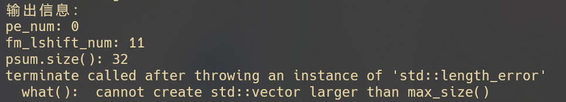

# 一些问题 10-23

## 关于OPU simulator

- OPU模拟后报错
```c++
// Output control for accumulation
  void Accumulate(int fm_lshift_num, int pe_num, bool cut, void* dst, 
    std::ofstream& os, bool dump) {
    std::cout << "Accumulate begins " << "\n";
    std::cout << "输出信息：" << "\n";
    std::cout << "pe_num: " << pe_num << "\n";
    std::cout << "fm_lshift_num: " << fm_lshift_num << "\n";
    std::cout << "psum.size(): " << psum.size() << "\n";
    std::vector<acc_type> adder_a(2*pe_num/(PRECISION/8) - psum.size(), 0);
    for (int i = 0; i < psum.size(); i++) {
    ···
    output_info为：
        pe_num: 0
        fm_lshift_num: 11
        psum.size(): 32
```

报错原因是建立数组的长度为负数
```c++
std::vector<acc_type> adder_a(2*pe_num/(PRECISION/8) - psum.size(), 0);
```

参数pe在compute阶段没有改动，保持初始值为0；
psum vector在forward卷积函数中数组大小变为32
测试了一下forward函数，输出的psum为数据全为0的长度为32的数组
推测是不是数据没有导入，导致第一段计算出现问题


> 问题已解决：在driver.cc line:103行添加 ```compute->pe_num = 32;```进行赋值即可。
> 通过```#ifdef MANUAL_INSTRS```语句来区分手动运算和导入bat数据来启动和测试simulator。

## compiler build
- 使用docker在笔记本本地创建镜像，后续内存不够，用何老师说的服务器能解决问题不，还是我用工位电脑？
- 配置过程中报错，无法安装python3.7（无法找到包），我将From ubuntu的版本修改为了20.04，后面LLVM的包版本仍然使用16，应该对后续没影响吧？
- compiler配置好了，由于内存问题，在sh download_model.sh这一步停下来了，后面的还没做。


**OTHER PRBLEMS**
[https://hpc.eias.ac.cn/login]
在该url注册
