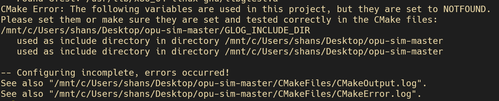
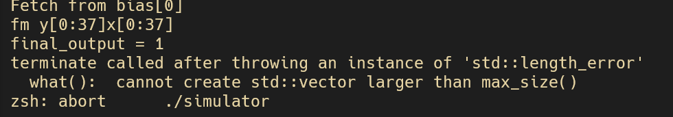

# Reading-Paper-And-Its-Code
## OPU: An FPGA-based Overlay Processor for Convolutional Neural Networks

*in folder src: its main and tests code*

### Part4 代码测试运行与论文  Time:2022-10-16-18

运行报错
1.
 
已解决：安装glog即可
2.
 
未解决

immi = static_cast<bool>((*data_ & (1 << 31)) >> 31); //in instruction.cc Decode()

出现的问题
- CNN和CNN加速是什么？
- CNN如果不在FPGA上实现能如何实现？
- 在FGPA上实现优势在哪？如何实现？

