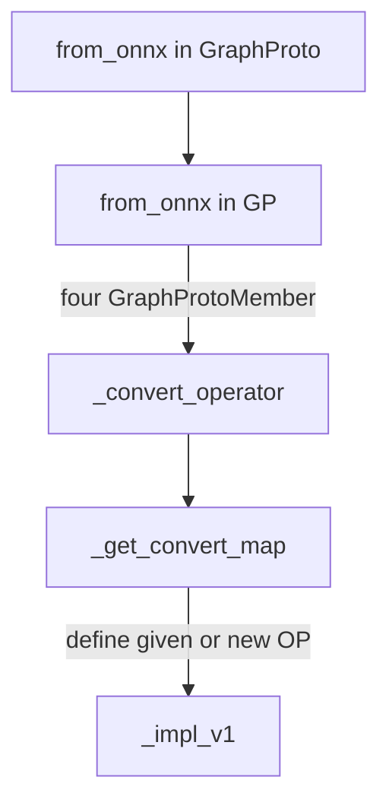

<!-- @import "[TOC]" {cmd="toc" depthFrom=2 depthTo=3 orderedList=false} -->

<!-- code_chunk_output -->

- [初步学习TVM](#初步学习tvm)
  - [TVM是如何将对应模型转化为TVM IR的](#tvm是如何将对应模型转化为tvm-ir的)
    - [the 1st-level func [from_onnx]](#the-1st-level-func-from_onnx)
    - [the 2nd-level func [from_onnx] in onnx graph g](#the-2nd-level-func-from_onnx-in-onnx-graph-g)
      - [GraphProto对象](#graphproto对象)
      - [Turn onnx GraphProto into helper class GP -> GraphProtoMember Parse](#turn-onnx-graphproto-into-helper-class-gp---graphprotomember-parse)
    - [the 3nd-level func [_convert_operator] in helper class GP](#the-3nd-level-func-_convert_operator-in-helper-class-gp)
      - [举例Conv的convert_map](#举例conv的convert_map)
    - [Conclusion: convert process func-level](#conclusion-convert-process-func-level)

<!-- /code_chunk_output -->

[TOC]

# 初步学习TVM

## TVM是如何将对应模型转化为TVM IR的

### the 1st-level func [from_onnx] 
基于onnx模型，TVM采用
```python
mod, params = relay.frontend.from_onnx(onnx_model, shape_dict)
```
函数来加载IR
mod 输出
```python
def @main(%input.1: Tensor[(1, 3, 224, 224), float32], %v193: Tensor[(64, 3, 7, 7), float32], %v194: Tensor[(64), float32], %v196: Tensor[(64, 64, 3, 3), float32], %v197: Tensor[(64), float32], %v199: Tensor[(64, 64, 3, 3), float32], %v200: Tensor[(64), float32], %v202: Tensor[(64, 64, 3, 3), float32], %v203: Tensor[(64), float32], %v205: Tensor[(64, 64, 3, 3), float32], %v206: Tensor[(64), float32], %v208: Tensor[(128, 64, 3, 3), float32], %v209: Tensor[(128), float32], %v211: Tensor[(128, 128, 3, 3), float32], %v212: Tensor[(128), float32], %v214: Tensor[(128, 64, 1, 1), float32], %v215: Tensor[(128), float32], %v217: Tensor[(128, 128, 3, 3), float32], %v218: Tensor[(128), float32], %v220: Tensor[(128, 128, 3, 3), float32], %v221: Tensor[(128), float32], %v223: Tensor[(256, 128, 3, 3), float32], %v224: Tensor[(256), float32], %v226: Tensor[(256, 256, 3, 3), float32], %v227: Tensor[(256), float32], %v229: Tensor[(256, 128, 1, 1), float32], %v230: Tensor[(256), float32], %v232: Tensor[(256, 256, 3, 3), float32], %v233: Tensor[(256), float32], %v235: Tensor[(256, 256, 3, 3), float32], %v236: Tensor[(256), float32], %v238: Tensor[(512, 256, 3, 3), float32], %v239: Tensor[(512), float32], %v241: Tensor[(512, 512, 3, 3), float32], %v242: Tensor[(512), float32], %v244: Tensor[(512, 256, 1, 1), float32], %v245: Tensor[(512), float32], %v247: Tensor[(512, 512, 3, 3), float32], %v248: Tensor[(512), float32], %v250: Tensor[(512, 512, 3, 3), float32], %v251: Tensor[(512), float32], %fc.bias: Tensor[(1000), float32], %fc.weight: Tensor[(1000, 512), float32]) {
  %0 = nn.conv2d(%input.1, %v193, strides=[2, 2], padding=[3, 3, 3, 3], kernel_size=[7, 7]);
  %1 = nn.bias_add(%0, %v194);
  %2 = nn.relu(%1);
```
> 可以看到这个mod其实就是一个函数（Relay Function），函数的输入就是ONNX模型中所有输入Tensor的shape信息，不仅包含真实的输入input.1，还包含带权重OP的权重Tensor的shape信息，比如卷积层的weight和bias。对应的mod, params = relay.frontend.from_onnx(onnx_model, shape_dict)这里的params则保存了ONNX模型所有OP的权重信息，以一个字典的形式存放，字典的key就是权重Tensor的名字，而字典的value则是TVM的Ndarry，存储了真实的权重（通过Numpy作为中间数据类型转过来的）。

### the 2nd-level func [from_onnx] in onnx graph g
该函数中关键语句为
```python
with g:
    mod, params = g.from_onnx(graph, opset)
return mod, params
```
#### GraphProto对象
其中graph为onnx protobuf 对象，其内部具有如下的一些信息，不限于node, attribute, input等：
```python
ir_version: 8
producer_name: "onnx-example"
graph {
  node {
    input: "X"
    input: "pads"
    input: "value"
    output: "Y"
    op_type: "Pad"
    attribute {
      name: "mode"
      s: "constant"
      type: STRING
    }
  }
  name: "test-model"
  input {
    name: "X"
    type {
      tensor_type {
        elem_type: 1
        shape {
          dim {
            dim_value: 3
          }
          dim {
            dim_value: 2
          }
        }
      }
    }
  }
  input {
    name: "pads"
    type {
      tensor_type {
        elem_type: 1
        shape {
          dim {
            dim_value: 1
          }
          dim {
            dim_value: 4
          }
        }
      }
    }
  }
  input {
    name: "value"
    type {
      tensor_type {
        elem_type: 1
        shape {
          dim {
            dim_value: 1
          }
        }
      }
    }
  }
  output {
    name: "Y"
    type {
      tensor_type {
        elem_type: 1
        shape {
          dim {
            dim_value: 3
          }
          dim {
            dim_value: 4
          }
        }
      }
    }
  }
}
opset_import {
  version: 15
}
```
GraphProto类定义如下：
```python
class GraphProto(object):
    """A helper class for handling Relay expression copying from pb2.GraphProto.
    Definition: https://github.com/onnx/onnx/blob/master/onnx/onnx.proto
        Parameters
    ----------
    shape : dict of str to tuple, optional
        The input shape to the graph
    dtype : str or dict of str to str
        The input types to the graph
    """

    def __init__(self, shape, dtype):
        self._nodes = {}
        self._params = {}
        self._renames = {}
        self._num_input = 0
        self._num_param = 0
        self._shape = shape if shape else {}
        self._dtype = dtype
    
    def from_onnx(self, graph, opset):
    ···
```

#### Turn onnx GraphProto into helper class GP -> GraphProtoMember Parse

[*ONNX结构分析*](https://bindog.github.io/blog/2020/03/13/deep-learning-model-convert-and-depoly/)
> 这里我把需要重点了解的对象列出来
> - ModelProto
> - GraphProto
> - NodeProto
> - AttributeProto
> - ValueInfoProto
> - TensorProto
> 我用尽可能简短的语言描述清楚上述几个Proto之间的关系：当我们将ONNX模型load进来之后，得到的是一个ModelProto，它包含了一些版本信息，生产者信息和一个非常重要的GraphProto；在GraphProto中包含了四个关键的repeated数组，分别是node(NodeProto类型)，input(ValueInfoProto类型)，output(ValueInfoProto类型)和initializer(TensorProto类型)，其中node中存放着模型中的所有计算节点，input中存放着模型所有的输入节点，output存放着模型所有的输出节点，initializer存放着模型所有的权重；那么节点与节点之间的拓扑是如何定义的呢？非常简单，每个计算节点都同样会有input和output这样的两个数组(不过都是普通的string类型)，通过input和output的指向关系，我们就能够利用上述信息快速构建出一个深度学习模型的拓扑图。最后每个计算节点当中还包含了一个AttributeProto数组，用于描述该节点的属性，例如Conv层的属性包含group，pads和strides等等，具体每个计算节点的属性、输入和输出可以参考这个Operators.md文档。
> 需要注意的是，刚才我们所说的GraphProto中的input输入数组不仅仅包含我们一般理解中的图片输入的那个节点，还包含了模型当中所有权重。举个例子，Conv层中的W权重实体是保存在initializer当中的，那么相应的会有一个同名的输入在input当中，其背后的逻辑应该是把权重也看作是模型的输入，并通过initializer中的权重实体来对这个输入做初始化(也就是把值填充进来)

from_onnx func中按如下顺序处理GraphProtoMember:
| GraphProtoMember | Type           |
| ---------------- | -------------- |
| initializer      | TensorProto    |
| input            | ValueInfoProto |
| node             | NodeProto      |
| output           | ValueInfoProto |

Q1: 处理member的顺序能否进行交换？

将四个不同type的数组按同样结构GPMember保存在helper class GP中，存储的代码如下：
- Part1: initializer
```python
## in from_onnx func
        # 解析网络的输入到relay中, 又叫参数，onnx的initializer就是用来保存模型参数的，即权重
        for init_tensor in graph.initializer:
            if not init_tensor.name.strip():
                raise ValueError("Tensor's name is required.")
            # 具体实现就是先把这个TensorProto使用get_numpy函数获得值，再reshape到特定形状，再基于这个numpy构造tvm.nd.array。
            '''
            def _parse_array(self, tensor_proto):
                np_array = get_numpy(tensor_proto).reshape(tuple(tensor_proto.dims))
                return _nd.array(np_array)
            '''
            array = self._parse_array(init_tensor)
            # 前面解释过，如果设置冻结参数，则将这个参数设置为Relay中的常量OP
            if self._freeze_params:
                
                self._nodes[init_tensor.name] = _expr.const(array)
            else:
                # g中_nodes为字典，name->[name, shape, dtype]，
                self._params[init_tensor.name] = array
                self._nodes[init_tensor.name] = new_var(
                    init_tensor.name,
                    shape=self._params[init_tensor.name].shape,
                    dtype=self._params[init_tensor.name].dtype,
                )
```
- Part2: input
处理onnx model的input，onnx model的input可以通过
```python
        # 解析ONNX模型的输入 graph为onnx model.GraphProto
        for i in graph.input:
            # 获取i这个输入的名字，shape，数据类型以及shape每个维度对应的名字
            i_name, i_shape, d_type, i_shape_name = get_info(i)
```
语句完成；
graph.input里面既有权重的同名输入，也有节点，即需要区分node和param
```python
 # 判断i这个输入是权重参数还是输入
          if i_name in self._params:
              # i is a param instead of input
              self._num_param += 1
              self._params[i_name] = self._params.pop(i_name)
              self._nodes[i_name] = new_var(
                  i_name, shape=self._params[i_name].shape, dtype=self._params[i_name].dtype
              )
          # 输入节点已经在Relay IR中了就不用处理了
          elif i_name in self._nodes:
              continue
          else:
              # 真正的输入节点，依赖用户进行指定
              self._num_input += 1
              self._input_names.append(i_name)
              if i_name in self._shape:
                  i_shape = self._shape[i_name]
              else:
                  if "?" in str(i_shape):
                      warning_msg = (
                          "Input %s has unknown dimension shapes: %s. "
                          "Specifying static values may improve performance"
                          % (i_name, str(i_shape_name))
                      )
                      warnings.warn(warning_msg)
              if isinstance(self._dtype, dict):
                  dtype = self._dtype[i_name] if i_name in self._dtype else d_type
              else:
                  dtype = d_type
              self._nodes[i_name] = new_var(i_name, shape=i_shape, dtype=dtype)
          self._inputs[i_name] = self._nodes[i_name]
```
- Part3: node
通过前两个Part处理完参数和输入的一些非法情况和不支持的操作后，可以保证node中所有算子都是可以被支持的了。

对node进行信息提取并对op进行转换，其中
| node   | NodeProto Type |
| ------ | -------------- |
| input  | String Type    |
| output | String Type    |

node中存储input和output来保存指向关系。

```python
 # 到这里说明这个ONNX模型的所有算子都被Relay支持，可以正常进行转换了
        for node in graph.node:
            op_name = node.op_type
            # 解析attribute参数
            attr = self._parse_attr(node.attribute)
            # 创建并填充onnx输入对象。
            inputs = onnx_input()
            for i in node.input:
                if i != "":
                    # self._renames.get(i, i)用来获取ONNX Graph每个节点的输入
                    inputs[i] = self._nodes[self._renames.get(i, i)]
                else:
                    inputs[i] = None
            #目前inputs的初始化使用的是下面的语句
            #inputs = [self._nodes[self._renames.get(i, i)] for i in node.input]
            i_name = self._parse_value_proto(node)
            node_output = self._fix_outputs(op_name, node.output)
            attr["tvm_custom"] = {}
            attr["tvm_custom"]["name"] = i_name
            attr["tvm_custom"]["num_outputs"] = len(node_output)
            # 执行转换操作
            op = self._convert_operator(op_name, inputs, attr, opset)

            ···
```
### the 3nd-level func [_convert_operator] in helper class GP
_convert_operator function如下:
```python
def _convert_operator(self, op_name, inputs, attrs, opset):
        """将ONNX的OP转换成Relay的OP
        转换器必须为不兼容的名称显式指定转换，并将处理程序应用于运算符属性。 

        Parameters
        ----------
        op_name : str
            Operator 名字, 比如卷积, 全连接
        inputs : tvm.relay.function.Function的list
            List of inputs.
        attrs : dict
            OP的属性字典
        opset : int
            Opset version

        Returns
        -------
        sym : tvm.relay.function.Function
            Converted relay function

        return value sym的type和输入参数inputs type一样，其中_get_convert_map返回一系列定义好的映射，如：
        def _get_convert_map(opset):
          return {
            # defs/experimental
            'Identity': Renamer('copy'),
            # 'Affine'
            'ThresholdedRelu': ThresholdedRelu.get_converter(opset),
            'ScaledTanh': ScaledTanh.get_converter(opset),
            'ParametricSoftplus': ParametricSoftPlus.get_converter(opset),
            'ConstantOfShape': ConstantOfShape.get_converter(opset),
            # 'GivenTensorFill'
            'FC': AttrCvt('dense', ignores=['axis', 'axis_w']),
            'Scale': Scale.get_converter(opset),
            "Conv": Conv.get_converter(opset),
        """
        convert_map = _get_convert_map(opset)
        if op_name in _identity_list:
            sym = get_relay_op(op_name)(*inputs, **attrs)
        elif op_name in convert_map:
            sym = convert_map[op_name](inputs, attrs, self._params)
        else:
            raise NotImplementedError("Operator {} not implemented.".format(op_name))
        return sym
```
#### 举例Conv的convert_map
> 我们以卷积层为例来看看ONNX的OP是如何被转换成Relay表达式的。卷积OP一般有输入，权重，偏置这三个项，对应了下面函数中的inputs[0],inputs[1],inputs[2]。而auto_pad这个属性是ONNX特有的属性，TVM的Relay 卷积OP不支持这种属性，所以需要将ONNX 卷积OP需要Pad的数值计算出来并分情况进行处理（这里有手动对输入进行Pad以及给Relay的卷积OP增加一个padding参数两种做法，具体问题具体分析）。然后需要注意的是在这个转换函数中inputs[0]是Relay IR，而不是真实的数据，我们可以通过打印下面代码中的inputs[0]看到。
```python
class Conv(OnnxOpConverter):
    """Operator converter for Conv."""

    @classmethod
    def _impl_v1(cls, inputs, attr, params):
        # Use shape of input to determine convolution type.
        data = inputs[0]
        input_shape = infer_shape(data)
        ndim = len(input_shape)
        if "auto_pad" in attr:
            attr["auto_pad"] = attr["auto_pad"].decode("utf-8")
            if attr["auto_pad"] in ("SAME_UPPER", "SAME_LOWER"):
                # Warning: Convolution does not yet support dynamic shapes,
                # one will need to run dynamic_to_static on this model after import
                data = autopad(data, attr["strides"], attr["kernel_shape"], attr["dilations"], ndim)
            elif attr["auto_pad"] == "VALID":
                attr["pads"] = tuple([0 for i in range(ndim - 2)])
            elif attr["auto_pad"] == "NOTSET":
                pass
            else:
                msg = 'Value {} in attribute "auto_pad" of operator Conv is invalid.'
                raise tvm.error.OpAttributeInvalid(msg.format(attr["auto_pad"]))
            attr.pop("auto_pad")

        out = AttrCvt(
            op_name=dimension_picker("conv"),
            transforms={
                "kernel_shape": "kernel_size",
                "dilations": ("dilation", 1),
                "pads": ("padding", 0),
                "group": ("groups", 1),
            },
            custom_check=dimension_constraint(),
        )([data, inputs[1]], attr, params)

        use_bias = len(inputs) == 3
        if use_bias:
            out = _op.nn.bias_add(out, inputs[2])
        return out
```
class OnnxOpConverter get_converter func相当于C++的虚函数，真正的实现是每个op class的_impl_v1 func，所以新建op只需要写该op的class再在_get_convert_map func中注册即可。
获取op后，再对op进行一些处理。

- Part4: output
```python
  # 解析ONNX模型的输出
        outputs = [self._nodes[self._parse_value_proto(i)] for i in graph.output]
        outputs = outputs[0] if len(outputs) == 1 else _expr.Tuple(outputs)
        # 如果需要直接返回转换后的表达式，在这里return
        if get_output_expr:
            return outputs
        # 保持来自ONNX Graph的输入和参数顺序，但仅仅包含这些需要执行转换到Relay的节点
        free_vars = analysis.free_vars(outputs)
        nodes = {v: k for k, v in self._nodes.items()}
        free_vars = [nodes[var] for var in free_vars]
        for i_name in self._params:
            if i_name in free_vars and i_name not in self._inputs:
                self._inputs[i_name] = self._nodes[i_name]
        # 根据我们的输出表达式和所有输入变量创建一个函数。 
        func = _function.Function([v for k, v in self._inputs.items()], outputs)
        # 把这个函数用IRModule包起来返回，并同时返回权重参数
        return IRModule.from_expr(func), self._params
```
### Conclusion: convert process func-level
